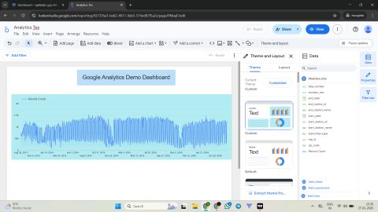

# Web Analytics Dashboard using Google Looker Studio

## Project Overview

This project presents an interactive web analytics dashboard created using Google Looker Studio and Google Analytics data. The dashboard helps analyze website traffic patterns, user engagement, and performance trends through visual reports.

## Dashboard Features

- Interactive date range controls
- Website traffic trend analysis
- User activity monitoring
- Custom dashboard layout
- Dynamic data visualization
- Google Analytics integration

## Tools & Technologies

- Google Looker Studio
- Google Analytics
- Google Cloud Platform
- Data Visualization

## Project Workflow

1. Connected Google Analytics as the data source.
2. Imported analytics data into Looker Studio.
3. Created time-series visualizations.
4. Added filters and controls.
5. Customized themes and layouts.
6. Published the dashboard for reporting.

## Dashboard Preview

## Skills Demonstrated

- Data Visualization
- Dashboard Design
- Business Intelligence Reporting
- Web Analytics
- Data Storytelling
